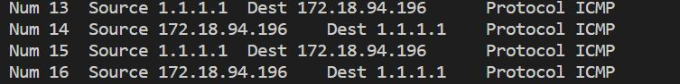

# KPU_WireShark (2021.10~12)

> rawsocket을 이용한 패킷 캡처 프로그램  

## 서버 환경

### 1. 프로토콜 별 시현 서버  

    HTTP– www.kpu.ac.kr  
    DNS – ns.kpu.ac.kr  
    ICMP –  google.com  

### 2. 클라이언트 환경

- 구동 운영체제  
  - 리눅스 ( 우분투 18.04.0 LTS )
- 사용 명령어
  - Curl  
  - Nslookup
  - Ping

## 실행 방법

```bash
> cd wireshark
> make
> sudo ./rawsocker #관리자 권한이 필요하다.

=====Program Menu=====
1.Capture Start  # 패킷 캡처
2.List View      # 캡처링한 패킷들 보기 
3.Select Packet  # 패킷 세부 내용 보기 , ./logdir에 저장된다.
4.set Filter     # 필터링 
5.set associate Filter # 2중 필터링
6.reset Filter   # 필터 제거
7.exit           # 종료

input :
```  

## 패킷 캡처



> 네트웍 인터페이스 카드에 들어오는 모든 패킷들에 대해서 접근할 수 있다.  


## 패킷 세부 내용 보기

> 분석한 패킷은 http, dns, icmp프로토콜에 대해서 조사했다.  
> 아래 예제는 icmp 패킷의 예이다.  
> [./Document/구현결과.pptx](https://github.com/karistin/KPU_WireShark/blob/main/Document/%EA%B5%AC%ED%98%84%EA%B2%B0%EA%B3%BC.pptx)에서 자세히 설명했다.  

```bash
===== Ethernet Header =====
Source Address 00 15 5D 4C 3E E4
Destination Address :00 15 5D A3 A6 49

===== IP Header =====
 -Version :4
 -Internet Header Length(IHL) : 20 bits
 -Type Of Service :0
 -Total Length :438 Bytes
 -Identification :52667
 -Time To Live :56
 -Protocol :6
 -Header Checksum :26154
 -Source IP :1.1.1.1
 -Destination IP :172.18.95.72
===== TCP =====
 -Source Port : 80
 -Destination Port : 59532
 -Sequence Number : ae01efe
 -Acknowldge Number : a244f147
=====HTTP=====

HTTP/1.1 301 Moved Permanently
Server: cloudflare
Date: Sun, 11 Dec 2022 12:10:53 GMT
Content-Type: text/html
Content-Length: 167
Connection: keep-alive
Location: https://1.1.1.1/
CF-RAY: 777e1ea4a9c5c080-ICN

<html>
<head><title>301 Moved Permanently</title></head>
<body>
<center><h1>301 Moved Permanently</h1></center>
<hr><center>cloudflare</center>
</body>
</html>

===== CHAR DATA =====
.......W...HTTP/
1.1.301.Moved.Pe
rmanently..Serve
r:.cloudflare..D
ate:.Sun,.11.Dec
.2022.12:10:53.G
MT..Content-Type
:.text/html..Con
tent-Length:.167
..Connection:.ke
ep-alive..Locati
on:.https://1.1.
1.1/..CF-RAY:.77
7e1ea4a9c5c080-I
CN....<html>..<h
ead><title>301.M
oved.Permanently
</title></head>.
.<body>..<center
><h1>301.Moved.P
ermanently</h1><
/center>..<hr><c
enter>cloudflare
</center>..</bod
y>..</html>..
y>..</html>..
```

> Ping 통신시 캡처링된 패킷의 예시  
